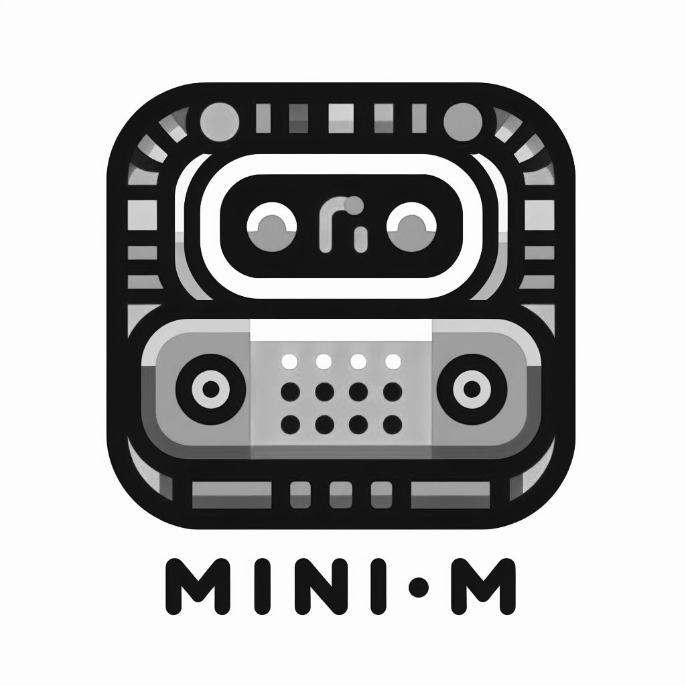
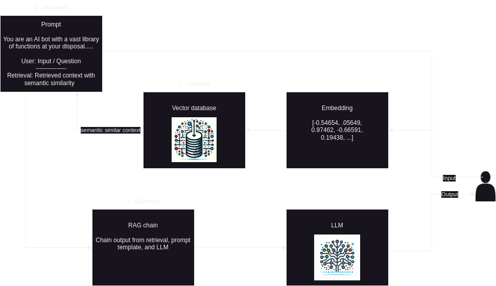

<p align="center">
    
</p>

mini-M is a personal assistant taking prompt/instruction from users to generate 
contents and files. At default, mini-M is set to have "diverse domains" including 
coding, writing, data manipulation. However, its knowledge domain can be updated 
interactively. To fully utilize domain switch, implementing RAG or fine-tuning is
needed. Here's a sample RAG pipeline:

<p align="center">
    
</p>

mini-M was made using PyProject Starter: https://github.com/mthnguyener/pyproject_starter

## Getting Started With mini-M
mini-M is a fully functioning Python package that may be installed using
`pip`.
Docker Images are built into the package and a Makefile provides an easy to call
repetitive commands.

Additionally, to run this you will need to request for Gemini
API: https://ai.google.dev/tutorials/python_quickstart. Replace `gemini` in 
`docker/secrets/gemini.txt` with your Gemini API. To use OpenAI, updates to 
response fields relating to function calling are required.

### mini-M Structure
- `app`: Applications directory where new apps can be added
  - `streamlit`: Streamlit service with sample pages (missing test atm)
    - `subpages`: Sample subpages for a Streamlit app
- `docker`: Docker directory
  - `mongo_init`: Folder with mongo init related files
  - `Dockerfile`: Dockerfiles for building Docker container images
  - `docker-compose.yaml`: Yaml file used by Docker Compose to define the services, 
  networks, and volumes for a multi-container application
- `docs`: Folder used by sphinx for auto-documentation
- `minim`: Project main script directory - additional apps are added here
  - `configs`: Project configuration files
  - `test`: Project unit tests
- `scripts`: Folder with setup related scripts

### Clone the Repository
First, make a local copy of the project.
After setting up SSH keys on GitHub call the following command to clone the
repository.
```bash
git clone https://github.com/mthnguyener/mini-m.git
```
A directory called `mini_m` will be created where the 
command was executed. This `mini_m` directory will be 
referred to as the "package root directory" throughout the project.

### Initialize the Project
Some functionality of the package is created locally.
Run the following command from the package root directory to finish setting up
the project.
```bash
make getting-started
```

### Run mini-M:
To run mini-M, run the following command at project root where `Makefile` is located.
```bash
make mini-m
```

### Jupyter Notebooks
While Jupyter notebooks are not ideal for source code, they can be powerful
when applied to path finding and creating training material.
The minim project is capable of creating a Jupyter 
server in the Python container. Since the package root directory is mounted to 
the Docker container any changes made on the client will persist on the host and
vice versa. For consistency when creating notebooks please store them in the 
`notebooks` directory. Call the following commands from the package root 
directory to start and stop the Jupyter server.

#### Create a Notebook Server
```bash
make notebook
```

#### Shutdown a Notebook Server
```bash
make notebook-stop-server
```

### Test Framework
The  is configured to use the pytest test framework in conjunction with
coverage and the YAPF style linter.
To run the tests and display a coverage report call the following command from
the package root directory.

#### Test Coverage
```bash
make test-coverage
```

To only run the tests, and not display the coverage, call the following.

### Tests
```bash
make test
```

#### Update Style
To only run the YAPF style linter call this command from the package root
directory.
```bash
make format-style
```

## Documentation
The package also has an NGINX container to host interactive documentation.
Calling the following commands from the package root directory will result in
a local web browser displaying the package HTML documentation.

### Build Documentation
```bash
make docs
```

### View Documentation without Building
```bash
make docs-view
```

### Makefile Code Completion
It's handy to have code completion when calling targets from the Makefile.
To enable this feature add the following to your user profile file.
- On Ubuntu this would be your `~/.profile` file.
- On a Mac this would be you `~/.bash_profile` file.
```bash
complete -W "`grep -oE '^[a-zA-Z0-9_.-]+:([^=]|$)' Makefile | sed 's/[^a-zA-Z0-9_.-]*$//'`" make
```

## Dependencies
Since the minim utilizes NVIDIA optimized Docker 
images most of the Python dependencies could be installed using PIP or Conda.
The `requirements.txt` file contains a reference to the specific
base image used during development and a list of dependencies.

There is a make target to update the requirements file.

```bash
make package-dependencies
```

## Profilers
Before refactoring it's usually a ***great*** idea to profile the code.
The following methods describe the profilers that are available in the 
minim environment, and how to use them.


### SNAKEVIZ Execution
To test an entire script just enter the following from the project root
directory.

#### Profile Script
```bash
make snakeviz PROFILE_PY=script.py
```

### Memory Profiler
1. Open Jupyter Notebook
1. Load Extension
    - `%load_ext memory_profiler`
1. Run profiler
    - `%memit enter_code_here`

